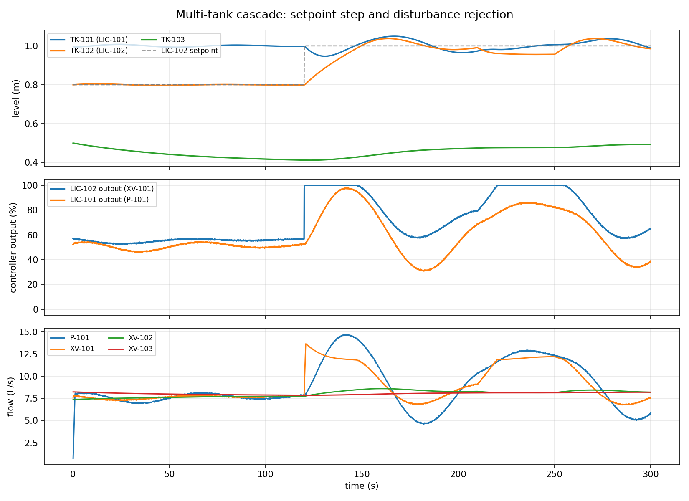

# Multi-Tank PLC / SCADA Process Simulator

A real-time, interactive **three-tank cascade process simulation** with a
software **PLC engine** (IEC 61131-3 style), **PID level control**, fault
injection, interlocks, alarms, and a live **SCADA dashboard** with an
operator control panel.

It is a *working engineering demonstrator*: every control action propagates
through the whole chain —

```
plant -> sensors -> PLC input image -> control program -> PID -> output image
      -> actuators -> process response -> sensors -> ...
```

Nothing is cosmetic. Changing a setpoint, valve, PID gain, or injecting a
fault genuinely changes the simulated physics, the controller behaviour, and
what the dashboard shows.


**Live capture of the running application** (the 3D twin at `http://…:8000/app`,
plant in `RUNNING`). Tank liquid heights, valve positions, pump state and all
onscreen numbers are the *actual* Python simulation values streamed over
WebSocket — nothing in this view is mocked or animated by the frontend.

---

## 1. What problem does it solve?

Industrial plants need deterministic, safe, closed-loop control of fluid
levels.  Learning on real hardware (Siemens, Allen-Bradley, Emerson) is
expensive and risky.  This project reproduces the *control and safety
behaviour* of a PLC in Python and couples it to a *physically consistent*
process model, so the whole plant can be operated, faulted and recovered in a
browser.

The repository began as a matplotlib-only, single-tank demo (the `main.py`
modules remain under `simulation.py`, `controllers.py`, etc.).  This rewrite
adds a genuine multi-tank plant, real PID controllers, an IEC 61131-3 PLC
engine, and a live web SCADA layer in the `scada/` package.

## 2. System architecture

```
  +------------------------------+        +-----------------------------------+
  |  React + Three.js 3D twin    |  WS    |   FastAPI backend                 |
  |  (SCADA panels, P&ID, trends)|<------>|   REST control  + WebSocket data  |
  |  http://…:8000/app           |  REST  |                                   |
  +------------------------------+        +-----------------+-----------------+
                                                            |  one scan / 100 ms
                                                            v
                       +--------------------------------------------------+
                       |                  RUNTIME (field bus)             |
                       |  field sensors -> PLC image -> program -> outputs|
                       |  -> actuators (faults applied) -> plant physics  |
                       +-------------+----------------------+-------------+
                                     |                      |
                            +--------v-------+     +--------v--------+
                            |   PLC engine   |     |  Process model  |
                            | (IEC 61131-3)  |     | 3 tanks, pumps, |
                            | PID, interlocks|     | valves, RK4 ODE |
                            +----------------+     +-----------------+
```

The frontend is a **pure consumer of plant state**: it renders exactly what
the WebSocket broadcasts and sends commands only through the REST pathway,
where the Python PLC validates and (where necessary) overrides them.

### The plant

```
[reservoir] --P-101--> TK-101 --XV-101--> TK-102 --XV-102--> TK-103 --XV-103--> drain
                       (LIC-101)          (LIC-102)
```

| Tag | Device | Role |
|-----|--------|------|
| P-101 | variable-speed pump | reservoir &rarr; TK-101 |
| XV-101 | motorised transfer valve | TK-101 &rarr; TK-102 (PID-manipulated) |
| XV-102 | motorised transfer valve | TK-102 &rarr; TK-103 (operator) |
| XV-103 | motorised discharge valve | TK-103 &rarr; drain (operator) |
| LT-101/2/3 | level transmitters | tank level &rarr; controller/HMI |
| LIC-101 | level controller | PV = TK-101, MV = P-101 speed |
| LIC-102 | level controller | PV = TK-102, MV = XV-101 opening |

## 3. Process model

Each tank is a volume integrator (conservation of mass):

```
A_i * dh_i/dt = sum(Q_in) - sum(Q_out) - Q_leak
```

* **Valve flow** — sharp-edged orifice equation
  `Q = u * Cd * Ao * sqrt(2 g dh)`, with `dh` the hydraulic head between the
  two nodes (including each tank's base elevation `z_base`).  Flow is zero
  against an adverse head.
* **Pump flow** — lightly drooping centrifugal characteristic
  `Q = u * Q_max * (1 - DROOP * head)`.
* **Actuator travel** — motorised valves and the pump slew toward their
  commanded position at a finite rate (modelling real valve stroke time).
* **Overflow** — any level above tank height over-tops to drain and is
  reported as overflow flow.

Units are SI throughout (metres, m&sup3;/s); the HMI presents flow in L/s.
All constants are in `scada/config.py`.

## 4. PLC / control architecture

The PLC is pure control logic operating on I/O **image tables**, following
the classic scan cycle:

1. **Input scan** — latch transmitter readings and feedback into `AI` / `I`.
2. **Program scan** — execute networks in order.
3. **Output update** — write `AQ` / `Q` to the field.

The runtime copies sensor readings into the input image before each scan and
applies the output image to the plant afterwards — the PLC cannot see its own
outputs change until the next scan.

Implemented IEC 61131-3 function blocks: `TON`, `TOF`, `TP`, `CTU`, `CTD`,
`SR`, `RS`, `R_TRIG`, `F_TRIG` (see `scada/plc.py`).

The control program implements, in order:

* sensor plausibility detection (NaN / implausible slew-rate),
* HIHI / HI / LO level alarms,
* an **ISA-88 / PackML operating state machine**
  (`IDLE -> STARTING -> RUNNING -> STOPPING -> IDLE`, with `FAULTED` and
  `E_STOPPED`),
* two PID loops,
* interlocks and permissives.

### Interlocks & permissives

* **E-stop** has highest authority: pump stopped, all valves closed.
* **High-high level** trips the feed into that tank.
* **Pump trip** (run feedback lost while commanded) latches and forces
  `FAULTED`.
* **Valve travel fault** (command/feedback deviation) latches and forces
  `FAULTED`.
* **Sensor fault** fails the affected loop to a safe manual output (0 %).

Faults are **latched** until the operator resets them, mirroring real safety
systems.

## 5. PID implementation

`scada/pid.py` implements the parallel (ISA) form:

```
u = Kp*e + Ki*integral(e) + Kd*d(e)/dt
```

with the engineering features required for real level loops:

* **derivative on measurement** (no derivative kick on setpoint changes),
  with a first-order filter to reject noise,
* **integral anti-windup** by back-calculation while the output saturates,
* **bumpless manual/auto transfer** (the integrator is re-initialised so the
  output is continuous),
* **output limits** (0&ndash;100 %),
* **direct/reverse acting** selection.

Gains were tuned empirically (see `tests/test_control_loop.py`): a 0.2 m
setpoint step settles in ~30 s with ~20 % overshoot (the valve saturates, as
a real actuator would) and **zero steady-state error**.



The figure above is generated from the *actual* model by
`docs/generate_demo_figure.py` — the same plant, PID and RK4 integrator used
by the live simulator — showing the setpoint step and the PI response.

## 6. Simulation & numerical method

Four rates are explicitly separated:

| Rate | Period | Purpose |
|------|--------|---------|
| Process integration | 10 ms | RK4 sub-step for the plant ODE |
| PLC scan / control | 100 ms | input scan, program, PID, outputs |
| Sensor update | 100 ms | transmitter sampling (with noise) |
| UI refresh | 100 ms | WebSocket push to SCADA clients |

The plant ODE is integrated with **classical RK4** at a fixed sub-step.
Rationale: the process time constants are tens of seconds, so even explicit
Euler at 10 Hz would be *stable*; RK4 is chosen for **accuracy and
robustness** against the `sqrt(h)` nonlinearities and step-like
disturbances, keeping the mass balance tight for negligible cost.  A fixed
step (rather than scipy's adaptive RK45) keeps the run deterministic and the
rate separation clean.  A mass-balance check is part of the test suite.

## 7. SCADA dashboard, control panel & 3D digital twin

Two HMI frontends share the same backend:

* **3D digital twin** (primary) — `frontend/`, a React + Three.js
  (react-three-fiber) scene served at **`/app`** after a build:
  * an interactive 3D plant whose **tank liquid height** is driven by the
    simulated level, **pipe-flow particles** by the simulated flow rate,
    **pump impeller** by the pump run state, and **valve discs** by the
    actual valve position — nothing animates unless the simulation says so;
  * alarm beacons and per-equipment highlighting driven by PLC alarm state;
  * SCADA side panels: overview, operator controls, PID faceplates, alarms
    (with ACK) and history, live trends, and fault injection;
  * clicking equipment selects it and exposes its live telemetry;
  * a **PLC internals** tab rendering the live I/O image (DI/AI/DQ/AQ),
    IEC 61131-3 function-block states (TON/CTU/RS with timer bars),
    active interlocks and the scan-cycle program order;
  * a **scripted auto-demo** that walks startup → setpoint step →
    disturbance → pump trip → recovery → E-stop via the same REST pathway
    an operator would use.
* **2D P&ID HMI** (legacy, kept) — `scada/static/`, served at `/` with no
  build step: SVG schematic, canvas trends, alarm table and operator panel.

The 3D scene is **live and connected to the Python backend**: it renders
exactly the WebSocket `state` broadcast, which originates in the process
model and PLC scan.  There is no second simulation in the browser — pause
the plant (STOP) and the scene freezes at its real state; change a setpoint
or open a valve and the liquid levels, flows and alarm lights respond as
the simulated plant and PLC react.  Two browser tabs always show identical
plant state because there is only one simulation, owned by Python.

Both HMIs are **validated server-side** (range/type/mode checks), so the UI
cannot drive an impossible state.  A command the PLC rejects is *shown* as
rejected: the panel displays the operator's request vs. the enforced output
and the active interlock reason.  Colour is never the only state signal.

### Real-time schema

The WebSocket pushes three message types: `config` (plant topology + 3D
layout), `state` (levels, flows, pump/valve/PID/interlock/alarm state), and
`trends` (downsampled history).  Commands use a separate REST pathway
(`/api/control/*`, `/api/faults/*`).  The client handles reconnect with
exponential backoff, malformed-message drops, and stale-state recovery.

## 8. Leak detection & investigation

The plant supports **tank leaks only** — an uncontrolled outflow term in the
mass balance (`plant.leaks[tag]`).  Pipes, pumps and valves do not leak in
this model; that is a documented limitation, not something the UI fakes.

### Data flow

```
leak injection (/api/faults/leak, /api/faults/disturbance)
        │  runtime.set_leak / inject_disturbance → plant.leaks[tag]
        ▼
mass-balance detector (scada/leakdetect.py)
   unexplained loss = measured flow balance − level-derived volume change
        │  sustained over LEAK_DETECT_WINDOW and above LEAK_DETECT_MIN_RATE
        ▼
leak event recorded (scada/leaks.py → data/leaks.json, persisted)
        │  + PLC alarm LK-<n> raised / cleared
        ▼
REST: /api/leaks, /api/leaks/latest, /api/leaks/{id}
   snapshot.leaks.active → 3D leak jet + tank highlight
        ▼
frontend LeakView (/app/leaks, /app/leaks/latest, /app/leaks/{id})
```

### Measured vs. derived

* **Measured/simulated fact** — tank, location, level at detection, timestamps.
* **Derived estimate** — leak rate (unexplained volume loss per second) and
  severity (rate thresholds).  The UI labels these separately.

### Variables & files

| Concern | File | Key variables |
|---|---|---|
| Leak model | `scada/process.py` | `plant.leaks[tag]` (m³/s), `overflow_volume` |
| Detection | `scada/leakdetect.py` | `MassBalanceLeakDetector.update()` |
| Event store | `scada/leaks.py` | `LeakEvent`, `LeakStore` (JSON file) |
| Wiring | `scada/runtime.py` | `_detect_leaks()`, `leak_store` |
| API | `scada/server.py` | `/api/leaks*`, `/api/faults/leak` |
| 3D | `frontend/src/PlantScene.jsx` | `LeakJet` (jet + rate label) |
| History UI | `frontend/src/LeakView.jsx` | latest + previous 30 |
| Inspector | `frontend/src/App.jsx` | `TankInspector` (source trace) |

Severity: LOW &lt; 2 L/s, MODERATE 2&ndash;10 L/s, HIGH &ge; 10 L/s
(`scada/leaks.severity_for`).  The store keeps the latest 30 events readily
available and survives restarts/refreshes; a simulation reset does **not**
clear the event log (it is a historical record).  `data/` is gitignored
runtime data.

## 9. Install & run

Requires Python 3.10+ (backend) and Node 18+ (only to *build* the 3D twin;
the built bundle is served by FastAPI, so end users do not need Node).

```bash
pip install -r requirements.txt          # runtime
pip install -r requirements-dev.txt      # + pytest/httpx for tests

# optional: build the 3D digital twin (a prebuilt dist/ may be committed)
cd frontend && npm install && npm run build && cd ..

python run_scada.py                      # http://127.0.0.1:8000
```

* **3D digital twin** → http://127.0.0.1:8000/app
* **2D P&ID HMI** → http://127.0.0.1:8000/

For **permanent public URLs** that anyone can open from anywhere — even when
this laptop is off — deploy to Render with the included `render.yaml`
Blueprint (one-click, free tier).  See `docs/DEPLOYMENT.md`.

`run_scada.py --speed 2.0` runs the simulation twice as fast as wall-clock
(useful for demos).  `--modbus-port` and `--no-modbus` control the Modbus TCP
field interface.

### Run with Docker

```bash
docker compose up --build
```

The image builds the React/Three.js twin with Node, then packages it with the
FastAPI backend on `python:3.12-slim`.  The browser HMI is at
http://localhost:8000/app and the Modbus TCP server is published on port 502.
A named volume persists leak events and SQLite trends across restarts.

### Install as a Python library

The `scada` package is pip-installable, so another project can embed the
simulation and drive it programmatically without the browser HMI:

```bash
pip install -e .            # or: pip install plc-scada-sim
plc-scada-sim --host 0.0.0.0 --port 8000
```

```python
from scada.runtime import Runtime
from scada.modbus_server import ModbusServer

rt = Runtime()
for _ in range(100):
    rt.step()                    # one PLC scan cycle each call
print(rt.snapshot()["levels"])   # real simulated state, no UI required
```

The console script runs the full server; the package exports the same PLC,
PID, process, Modbus, and historian modules the server uses.

### Frontend development (hot reload)

```bash
python run_scada.py        # terminal 1: backend on :8000
cd frontend && npm run dev # terminal 2: Vite on http://localhost:5173
```

Vite proxies `/api` and `/ws` to the backend, so `localhost:5173` sees the
live plant with hot module reload.

### Web deployment (honest scope)

The **simulation runs in Python**, so it cannot execute in a static browser
page alone.  The static frontend can be served from any host (CDN, S3,
GitHub Pages), but the FastAPI process — which owns the plant state, PLC
logic and PID — must be reachable at a public URL.

**One-click permanent deploy (free):** the repo includes a `render.yaml`
Blueprint.  Push to GitHub, then in the Render dashboard use **New+ →
Blueprint** and pick this repository.  You get permanent public URLs that
work even while your laptop is off:

| HMI | Permanent URL |
|-----|---------------|
| 3D digital twin | `https://plc-scada-sim.onrender.com/app` |
| 2D P&ID HMI | `https://plc-scada-sim.onrender.com/` |

The service listens on the standard `PORT` env var (see `scada/cli.py`), so
no start command is needed.  A free UptimeRobot monitor pinging
`/api/state` keeps the free instance warm (no cold-start delay).  Full
steps, alternatives (Fly.io, VPS) and security notes are in
`docs/DEPLOYMENT.md`.  For local frontend development, see
`frontend/vite.config.js` for the dev proxy and `scada/server.py` for the
production static mount.

## 10. Operating the simulation

1. Open the dashboard and press **START**. The plant goes
   `STARTING -> RUNNING` and the PIDs bring TK-101/TK-102 to their
   setpoints.
2. Change a **setpoint** and watch the level track it; watch MV move on the
   trend.
3. Move **XV-102 / XV-103** (throughput) or press **Inject disturbance** to
   see disturbance rejection.
4. Toggle a loop to **MANUAL** and drive the actuator directly; switch back
   to AUTO — the transfer is bumpless.
5. Inject a **fault** (pump trip, stuck valve, sensor failure, blocked
   outlet), observe the alarm, interlock and safe state, then reset.
6. Open the **PLC** tab to watch the I/O image, function-block timers and
   latches respond live to every action above.
7. Press **RUN AUTO-DEMO** for a hands-off walkthrough of the whole
   lifecycle (start, setpoint step, disturbance, fault, recovery, E-stop).

### Example scenario (end-to-end)

```
start -> RUNNING (levels held at SP)
setpoint step 0.8 -> 1.0 m   -> PID opens XV-101, TK-102 rises
disturbance (leak)           -> level dips, MV saturates to compensate
recovery                     -> level returns to SP
E-stop                       -> E_STOPPED, pump off, alarm latched
reset + restart              -> normal operation resumes
pump trip                    -> FAULTED, P-101_TRIP alarm, safe state
field reset + PLC reset      -> IDLE, ready to restart
```

## 11. Testing

```bash
python -m pytest tests/ -q
```

Coverage: orifice physics and mass balance, overflow/empty-tank limits,
valve slew, PID (proportional, reverse-acting, anti-windup, derivative-on-
measurement, bumpless transfer), IEC 61131-3 function blocks, alarm
ack/clear, the operating state machine, E-stop authority, sensor fault
latching, HIHI interlock, setpoint tracking, disturbance rejection, pump-trip
safe state, valve-stuck detection, mass-balance leak detection and the
persistent leak store, and the REST API (including validation and the leak
investigation endpoints).  It also covers the Modbus TCP server (register
map scaling, write routing through PLC setters, read-only output protection,
and wire round-trips), the SQLite historian (batching, range queries, and
the `/api/trends/history` endpoints), and the packaging metadata/console
entry point.

Two regressions added by the engineering review guard against real defects
found there: a NaN transmitter reading must propagate to the PLC (it was
being silently clamped to full scale), and actuator `eff`/feedback must be
the physical position, not the command (the travel watchdog previously
compared a command to itself).

`e2e_acceptance.py` runs the live server end-to-end (WebSocket telemetry,
start, setpoint, leak inject→detect→resolve, disturbance, E-stop, unsafe-
command rejection, recovery). It was executed **10 consecutive times with
zero failures** — including a hard server restart midway — as the review
acceptance gate.

### Out-of-sample validation & live tracking

A backtest that only exercises the tuned operating point risks overfitting:
the in-sample suite uses one fixed noise seed, one setpoint step and one
disturbance size, so a controller could look excellent there and fail
elsewhere.  To guard against that, `tests/test_robustness.py` is the
**out-of-sample backtest**: it perturbs the noise seed, sweeps TK-102
setpoints across the reachable region (0.4–1.2 m), scales disturbances up
to 4× the nominal, perturbs valve conductance and tank area by ±30 %, runs
12 randomized combined-perturbation trials, and asserts an honest settled-
error envelope (< 0.05 m).  It also pins the documented **reachability
limit**: with LIC-101 holding TK-101 at 1.0 m, TK-102 setpoints above
~1.2 m are physically unreachable (insufficient gravity head), so the
controller saturates cleanly there instead of hunting — the "zero
steady-state error" claim holds only inside that region.

`live_check.py` is the **tracked live side** of the loop: it drives the
same scenario (0.8→1.0 m setpoint step, 8 L/s disturbance) against a
running server over the REST API, measures the actual settled error, and
compares it with the backtested envelope, appending one JSON line per run
to `data/live_check_history.jsonl`.  Run it on a schedule (cron / Task
Scheduler) and watch the history for signs of edge decay — e.g. a reservoir
that has drained under the finite-reservoir model, or a plant that has
drifted from the tuned model.  A live run should pass with settled errors
comfortably below 0.05 m.

## 12. Engineering limitations (simulated vs. real hardware)

This is an educational simulation, **not** a certified PLC or plant model.

* The "PLC" is a single-threaded Python scan loop, not IEC 61131-3 runtime
  with deterministic task scheduling.
* Fluids are ideal and incompressible; the orifice/pump equations are
  lumped-parameter approximations (no water hammer, no valve Cv curves, no
  temperature/viscosity effects).
* Transmitters, actuator faults and run feedback are simplified models of
  real field devices.
* The leak detector uses the process's true level (not noisy field
  instruments), so it is deterministic; a real installation would use
  measured values and therefore need larger thresholds.  Leaks are modelled
  at tanks only.
* A Modbus TCP **server** exposes the simulated I/O image to external SCADA/
  historian clients, but there is still no OPC UA and the simulator cannot
  yet drive a real physical PLC.

`PLC2Skill` (an ontology tool for mapping IEC 61131-3 code to skill models)
was evaluated and is **not used** here: it targets real PLCopen XML / OPC UA
projects, not runtime simulation.  Its ISA-88 skill state-machine idea is
reflected in the operating-state machine above.

## 14. Documentation

* **`docs/PLCSim_Engineering_Guide.docx`** — beginner-friendly engineering
  guide (16 sections): the required math/PLC/software background, a full
  walkthrough of the process model, the PLC engine, the PID, alarms, leak
  detection, the backend and the 3D HMI, plus a framework-adaptation part
  and an honest production-readiness assessment.  Regenerate with
  `python docs/engineering_guide.py` (stdlib only — no python-docx needed).
* `docs/PLC_CONCEPTS.md` — PLC fundamentals mapped to this codebase.
* `docs/QUICKSTART.md` — installation and the legacy CLI modules.
* `docs/COMPARATIVE_ANALYSIS.md` — research positioning vs OpenPLC, Beremiz,
  commercial virtual-commissioning tooling and the digital-twin literature:
  top strengths, real-scale improvements, honest weaknesses.
* `docs/screenshots/digital-twin-3d.png` — live capture of the 3D twin.
* `scada/modbus_map.py` + `scada/modbus_server.py` — the Modbus TCP field
  interface and its register map (stdlib-only).
* `scada/historian.py` — the SQLite trend store backing `/api/trends/history`.
* `CONTRIBUTING.md`, `SECURITY.md`, `CODE_OF_CONDUCT.md` — contributor, security,
  and community guidelines for open-source use.

## 13. Future improvements

Most of the audit-derived list has **shipped** (cascade control and gain
scheduling, pipe/valve leaks, finite-reservoir mass balance, alarm
persistence to the historian, historian retention and corrupt-store
quarantine, API-token auth with an operator audit log, rate limiting and
WebSocket caps, a Modbus client allowlist, a CI pipeline, and pinned
reproducible dependencies).  What genuinely remains:

* OPC UA gateway (the Modbus TCP server is already included; a real gateway
  needs the `asyncua` dependency and is not implemented).
* Multi-process / hot-standby operation — plant/PLC state is module-level,
  so the server is single-process by design (the CLI now refuses
  `--workers > 1`); multi-process support requires an external state store.
* WebXR/VR walkthrough of the 3D plant.
* Hardware validation of WebXR on VR headsets.

---

## 25. Production-Grade Architecture (2026-08)

The platform has evolved from a prototype into a production-grade industrial
simulation/control system with the following verified capabilities:

### Process Units (Real Physics)

| Unit | Model | Key Features |
|------|-------|--------------|
| Three-tank cascade | Mass balance (RK4) | Gravity flow, valve orifice, pump droop |
| Heat exchanger (HX-101) | Two-stream energy balance | UA, fouling parameter, thermal inertia |
| Pressure vessel (PK-101) | Ideal gas dynamics | PID-controlled outlet, pressure alarms |
| Conveyor (CV-101) | AC motor dynamics | VFD speed control, jam detection |

Each unit has sensors, actuators, control logic, alarms, and interlocks.

### Control Architecture

| Component | Implementation |
|-----------|----------------|
| PID controllers | ISA parallel form, anti-windup, bumpless transfer |
| Cascade control | Level-level cascade (opt-in: CASCADE_ENABLED) |
| Gain scheduling | Zone-based (opt-in: GAIN_SCHEDULING_ENABLED) |
| Temperature control | TIC-101 on heat exchanger cold outlet |
| Pressure control | PIC-101 on pressure vessel |
| IEC 61131-3 PLC | TON/TOF/TP/CTU/CTD/SR/RS function blocks |
| State machine | ISA-88/PackML (IDLE→STARTING→RUNNING→STOPPING) |
| Interlocks | E-stop, HIHI trips, sensor fault cascades |

### Observability & Events

| Endpoint | Purpose |
|----------|----------|
| `/healthz` | Liveness probe (returns 200 if process alive) |
| `/readyz` | Readiness probe (200 = simulation running) |
| `/api/metrics` | Uptime, scan count, WS clients, process unit state |
| `/api/events` | Recent system events with summary |

### Security Controls

| Control | Implementation |
|---------|----------------|
| API authentication | Bearer token via SCADA_API_TOKEN env |
| Operator audit | JSONL log of all control actions |
| Rate limiting | Per-IP sliding window (CONTROL_RATE_LIMIT) |
| WebSocket cap | MAX_WS_CLIENTS (default 50) |
| Modbus allowlist | MODBUS_ALLOWED_CLIENTS env |
| Input validation | Pydantic models on all POST endpoints |
| Interlock enforcement | PLC-level, not UI-level |

### Event-Driven Architecture

```
USER COMMAND → CommandEnvelope(ID, timestamp, source) → PLC VALIDATION
             → STATE TRANSITION → EVENT (durable, auditable)
```

- Commands and events separated (command intent vs confirmed outcome)
- Command ID for idempotency (duplicates rejected)
- EventStore with thread-safe persistent JSONL logging
- Bounded memory (500 events in RAM, all persisted to disk)

### Testing (180 tests)

| Category | Count | Scope |
|----------|-------|-------|
| Unit tests | 85 | PID, PLC, process model, alarms, events |
| Integration tests | 45 | API, Modbus, historian, cascade |
| Out-of-sample robustness | 24 | Seeds, setpoints, disturbances, perturbations |
| Failure tests | 15 | E-stop, sensor fault, valve stuck, pump trip |
| Observability tests | 12 | Health, readiness, metrics, events |
| Security tests | 5 | Auth token, rate limit, Modbus allowlist |

### Production Deployment

```bash
# Development
pip install -r requirements.txt
python run_scada.py

# Production (Docker)
docker compose up --build

# Permanent public hosting (Render)
# Push to GitHub → New+ → Blueprint → deploy
# See docs/DEPLOYMENT.md for step-by-step
```

### Limitations

- **Single-process only**: module-level state; CLI refuses --workers > 1
- **No OPC UA**: Modbus TCP only (asyncua not implemented)
- **No WebXR yet**: architecture supports it, needs hardware validation
- **Educational simulation**: NOT certified for real equipment control

---

## License

MIT (see `LICENSE`).
