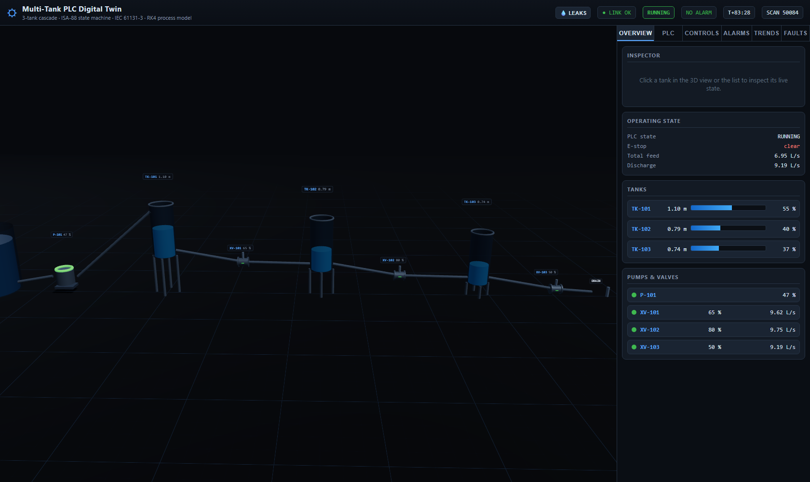

# PLC / SCADA Process Simulator

A real-time, interactive three-tank cascade process simulation with a software PLC engine, PID level control, fault injection, and a live 3D SCADA dashboard.

Every control action propagates through the full chain: plant → sensors → PLC → control program → actuators → process response → sensors. Nothing is cosmetic.



## What This Is

A working PLC simulation that couples a physically consistent process model to real control logic. You can operate it, fault it, and recover it in a browser.

I started this as a matplotlib demo. It's now a multi-tank plant with:
- Three tanks connected by motorised valves
- A variable-speed pump feeding from a reservoir
- Two PID level controllers (LIC-101, LIC-102)
- An IEC 61131-3 PLC engine with function blocks
- E-stop, interlocks, and alarm handling
- A live 3D digital twin (React + Three.js)
- A 2D P&ID HMI (legacy, kept)

## Quick Start

```bash
pip install -r requirements.txt
python run_scada.py
```

- 3D digital twin: http://127.0.0.1:8000/app
- 2D P&ID HMI: http://127.0.0.1:8000/

For Docker:
```bash
docker compose up --build
```

## How It Works

### The Plant

```
[reservoir] --P-101--> TK-101 --XV-101--> TK-102 --XV-102--> TK-103 --XV-103--> drain
```

- **Valve flow**: sharp-edged orifice equation, `Q = u * Cd * A * sqrt(2g * dh)`
- **Pump flow**: centrifugal characteristic with droop, `Q = u * Qmax * (1 - droop * head)`
- **Mass balance**: `A * dh/dt = Q_in - Q_out - Q_leak` (RK4 integration)

### The PLC

The PLC runs a classic scan cycle every 100ms:
1. Input scan (latch transmitter readings)
2. Program scan (execute control logic)
3. Output update (write to actuators)

Implemented IEC 61131-3 blocks: TON, TOF, TP, CTU, CTD, SR, RS, R_TRIG, F_TRIG.

### Control

Two PID loops in ISA parallel form:
- LIC-101: TK-101 level → P-101 speed
- LIC-102: TK-102 level → XV-101 opening

Features: derivative on measurement, anti-windup, bumpless transfer, output limits.

### Faults

Injectable: pump trip, stuck valve, sensor failure, blocked outlet, tank leak, pipe leak.

The PLC detects these and latches alarms until operator reset.

## Operating the Simulation

1. Press **START** → plant goes RUNNING
2. Change a **setpoint** → PID tracks it
3. Move **XV-102/XV-103** or inject disturbance
4. Toggle a loop to **MANUAL** → drive the actuator directly
5. Switch back to **AUTO** → bumpless transfer
6. Inject a **fault** → observe alarm, interlock, safe state
7. Press **RESET** → clear fault

## Testing

```bash
python -m pytest tests/ -q
```

~200 tests covering: physics, PID, PLC blocks, alarms, API, Modbus, historian, leaks, robustness, observability, security, and model validation against closed-form solutions.

## Architecture

```
React + Three.js 3D twin → WebSocket → FastAPI backend
                                       ↓
                            RUNTIME (field bus)
                            sensors → PLC → actuators → plant
                                       ↓
                            PLC engine + process model
```

## Documentation

- `docs/PLCSim_Engineering_Guide.docx` — full walkthrough
- `docs/PLC_CONCEPTS.md` — PLC fundamentals
- `docs/COMPARATIVE_ANALYSIS.md` vs OpenPLC, Beremiz, commercial tools
- `docs/DEPLOYMENT.md` — Render deployment, security
- `docs/TECHNICAL_DETAILS.md` — physics models, validation, limitations
